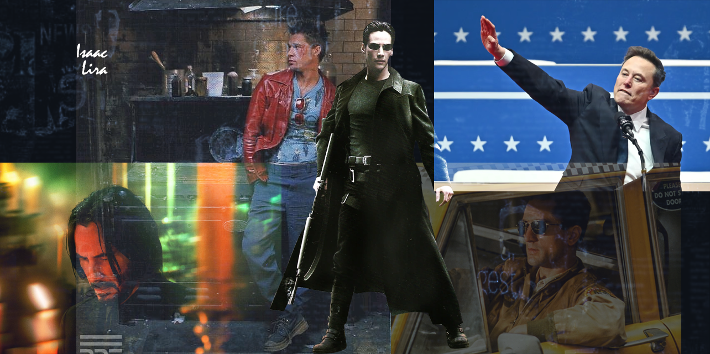

 # 🏄‍♂️ Isaac Lira

**`Digital Craftsman (Developer/Creator)`**

Hi, I'm Isaac, a 3D web developer from the beautiful Dominican Republic. I specialize in creating immersive, interactive 3D experiences for the web, combining creativity with functionality to bring ideas to life. With a passion for learning and improving my skills, I focus on delivering user-friendly and visually stunning solutions. I’m always excited to collaborate on projects that push the boundaries of web development, and I’m proud to contribute to the digital world from my vibrant home country. Let’s create something great together!
   

      
      
       
   

---

### 🧰 Languages and Tools

        

 

#

<!--Github stats Table--> 
Github Stats

 

#

<!--STARTS_HERE_QUOTE_CARD-->

    

<!--ENDS_HERE_QUOTE_CARD-->

<!--Contact Section--> 

  

 

<!--Footer--> 

  

